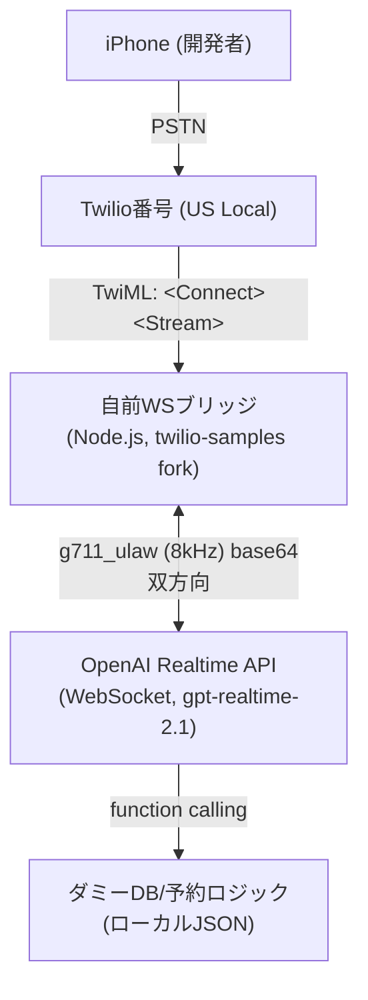
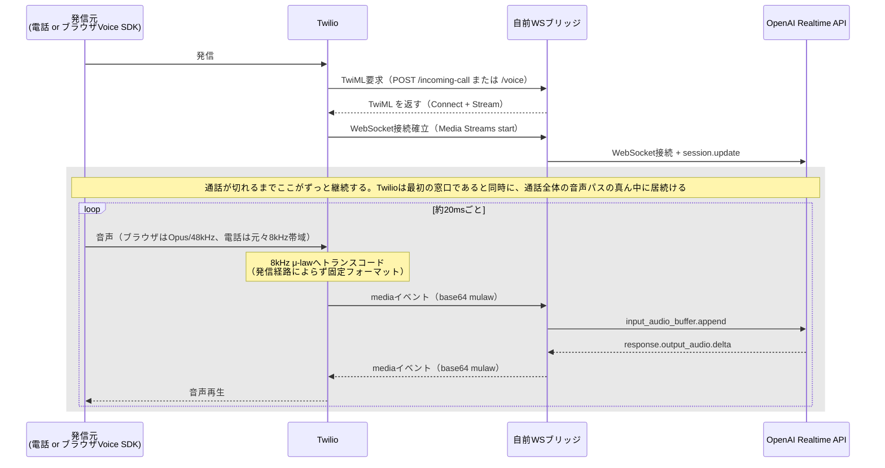
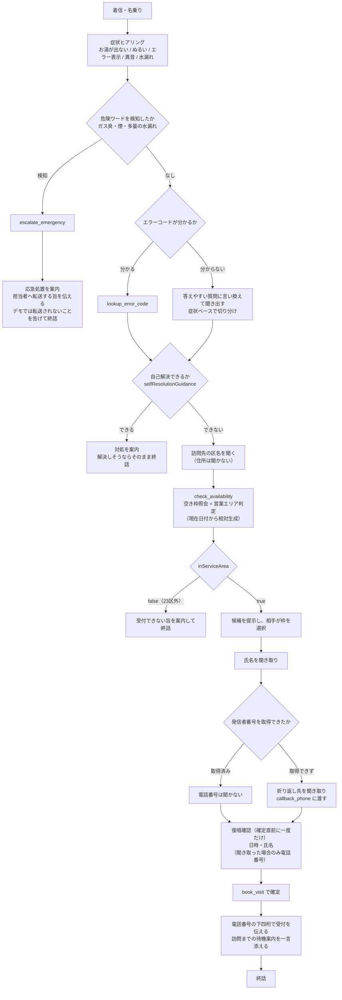
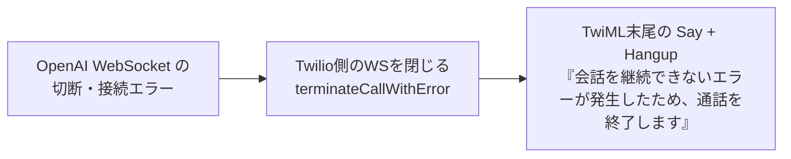

# gptlive-sts-demo

電話 × OpenAI Realtime API（`gpt-realtime-2.1`）を使った音声AIデモ。シナリオは架空の給湯器修理窓口サポート。個人のポートフォリオ用途。

詳細は [DESIGN.md](docs/DESIGN.md)（アーキテクチャ・技術判断）、[PLAN.md](docs/PLAN.md)（実装フェーズ）を参照。

## 動かし方（Mac / Windows）

**電話番号は不要。** ブラウザ（Twilio Voice SDK）から発信して試す構成になっている。PSTNからの着信は番号を取得していないため未検証。

### 1. 必要なもの

- **Node.js 20以上**（Fastify v5 の要件）
  - Mac: `brew install node`
  - Windows: `winget install OpenJS.NodeJS.LTS`
- **cloudflared**（ローカルサーバーを `https://` / `wss://` で公開するため）
  - Mac: `brew install cloudflared`
  - Windows: `winget install --id Cloudflare.cloudflared`
- **Twilioアカウント**（トライアルのままで動く。有料化しなくてよい）
- **OpenAI APIキー**（Realtime API が使えるもの）

### 2. Twilio側の準備

Twilio Console で以下を作る。**コンソールの画面構成は変わりやすいので、メニュー名ではなく作るものの名前で探すこと。**

1. **API Key** を発行する → `SK...` の SID と Secret を控える
2. **TwiML App** を作る → `AP...` の SID を控える（Voice の Request URL は手順5で設定する）
3. **Account SID**（`AC...`）をダッシュボードから控える

番号の購入は不要。

### 3. 設定ファイル

```bash
# Mac / Linux
cp server/.env-sample server/.env
```

```powershell
# Windows (PowerShell)
Copy-Item server\.env-sample server\.env
```

`server/.env` を開いて埋める。

```
OPENAI_API_KEY=sk-proj-xxx
TWILIO_ACCOUNT_SID=ACxxx
TWILIO_API_KEY=SKxxx
TWILIO_API_SECRET=xxx
TWILIO_TWIML_APP_SID=APxxx
PORT=5050
```

`.env` は `.gitignore` 済み。コミットしないこと。

### 4. ビルドと起動

```bash
cd server
npm install
npm run build     # クライアントのバンドルと接続音のWAVを生成
node index.js
```

Windowsも同じコマンドでよい（PowerShell / コマンドプロンプトのどちらでも）。`Server is listening on port 5050` が出れば起動している。

### 5. トンネルを張って Twilio に繋ぐ

別のターミナルで:

```bash
cloudflared tunnel --url http://localhost:5050
```

`https://<ランダムな文字列>.trycloudflare.com` が表示される。**この URL は起動のたびに変わる。**

表示された URL を使って、手順2で作った **TwiML App の Voice Request URL** に以下を設定する。

```
https://<発行されたURL>/voice
```

（HTTP メソッドは POST でよい）

### 6. 発信する

ブラウザで `https://<発行されたURL>/` を開き、マイクの使用を許可して発信する。`http://localhost:5050/` でも動くが、**Twilio 側の Webhook はトンネルの URL を向いている必要がある**。

うまくいけば、接続音のあとにAIが名乗って会話が始まる。

### つまずいたら

- **無音のまま何も始まらない** → TwiML App の Request URL がトンネルの URL を指しているか確認する。トンネルを張り直したら毎回貼り替えが要る
- **冒頭に英語のアナウンスが入る** → Twilio トライアルアカウントの仕様。有料化すると消える。動作には影響しない
- **5分で切れる** → 意図した挙動。`MAX_CALL_DURATION_MS`（既定 300000ms）で変えられる
- **`npm run build` が失敗する** → Node.js のバージョンを確認する（20以上）

---

## システム構成



- ブリッジサーバーは開発者のMac上でローカル起動し、Cloudflare Tunnelで`wss://`を公開する
- 音声フォーマットはTwilio⇄OpenAIともG.711 μ-law (8kHz)で統一（変換不要）
- 割り込み（barge-in）は`conversation.item.truncate` + Twilio `clear`イベントの2段構え（詳細はDESIGN.md 4章）

## 音声はどう流れているか

「呼び出し（TwiMLを取りに来る）」と「通話中の音声のやり取り」は別物で、後者もTwilioを経由し続ける。自前サーバーが発信元と直接つながることはない。



高品質なのはブラウザからTwilioのエッジまでの区間だけで、Media Streamsに乗る時点で電話と同じ劣化を受ける。ここが電話帯域の音声認識精度を確認するうえでの急所で、ブラウザでのテストが電話の代替として成立する根拠になっている。

## シナリオフロー（給湯器修理窓口）



終話は3つの経路（緊急エスカレーション後・受付完了後・営業エリア外）でサーバー側から能動的に切る。Realtime API自体に通話を切る手段がないため、AIが応答を話し終えたこと（`markQueue`が空になったこと）を確認してからTwilio REST APIで切断する。

会話継続が不可能になった場合は、AIに発話させずサーバー側で終話させる（OpenAIが落ちている状況ではAIに喋らせられないため、モデルに依存しない経路にしている）。



全体に効く方針:

- 金額は概算・目安も含めて一切答えない。「AIでの見積もりは行っていない」と伝え、担当者の確認に委ねる
- 訪問日時・在庫はツールの返り値以外を口にしない
- **聞き取るのは「訪問先の区名」「氏名」「希望枠」の3つだけ。** 住所は聞かない（区名で足りる）。電話番号は発信者番号を使うので原則聞かない
- 営業エリアは東京23区内のみ。エリア内かどうかの判定はAIに自己判断させず、`check_availability`の返り値（`inServiceArea`）に従わせる
- 受付情報（氏名・電話番号）は永続化しない。ログに残すのは電話番号の下4桁のみ
- 予約番号は発行せず、折り返し先の電話番号を受付キーにする
- 日本語以外に切り替えない。聞き取れなかった場合も日本語で聞き返す
